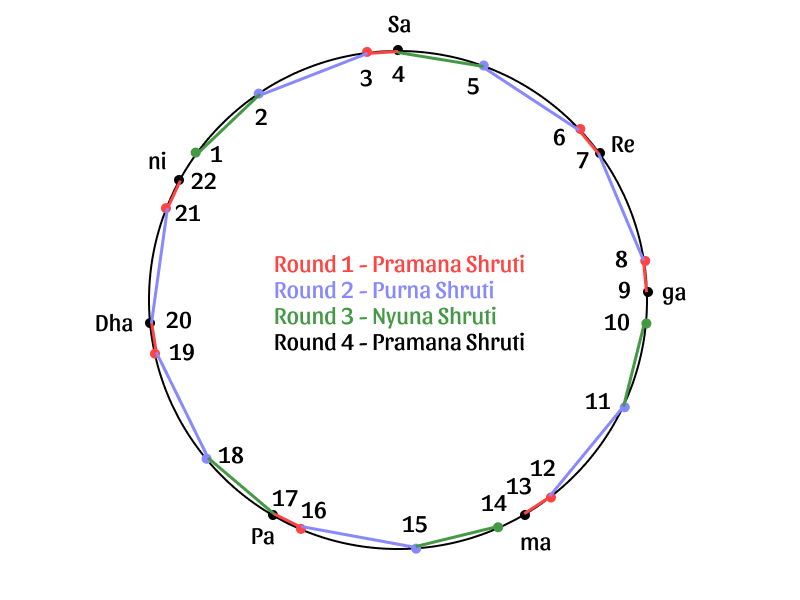

import scaleBasicIntervals from './basicIntervals.pkb'
import scaleSamaGana from 'data/default.pkb'
import scaleShadajGram from './shadajGramR0.pkb'
import scaleShadajGramR1 from './shadajGramR1.pkb'
import scaleShadajGramR2 from './shadajGramR2.pkb'
import scaleShadajGramR3 from './shadajGramR3.pkb'
import scaleShadajGramR4 from './shadajGramR4.pkb'
import genericDrone from 'data/default.prt'

export const notesBasicIntervals = [
    {white: "Sa", black: "fade"},
    {white: "fade", black: "fade"},
    {white: "Ga"},
    {white: "ma", black: "fade"},
    {white: "Pa", black: "fade"},
    {white: "fade", black: "fade"},
    {white: "fade"},
    {white: "SA"}
]
export const notesSamaGana = [
    {white: "Sa", black: "fade"},
    {white: "Re", black: "ga"},
    {white: "fade"},
    {white: "ma", black: "fade"},
    {white: "Pa", black: "fade"},
    {white: "Dha", black: "ni"},
    {white: "fade"},
    {white: "SA"}
]
export const notesShadajGram = [
    {white: "Sa", black: "Re♭"},
    {white: "Re", black: "ga"},
    {white: "fade"},
    {white: "ma", black: "fade"},
    {white: "Pa", black: "Dha♭"},
    {white: "Dha", black: "ni"},
    {white: "fade"},
    {white: "SA"}
]

# Indian Tuning Systems

To understand the role of harmonics, microtones and consonance in Indian Classical music, it is necessary to understand its underlying tuning systems. In this article, we reconstruct two significant tuning systems used in Indian Classical music:

1.  The first is a 22 note scale whose earliest reference is due to [Bharat](https://en.wikipedia.org/wiki/Bharata_Muni) in [Natya Shastra](https://en.wikipedia.org/wiki/Natya_Shastra) and which was later documented by [Sarang Dev](https://en.wikipedia.org/wiki/%C5%9A%C4%81r%E1%B9%85gadeva) in [Sangeet Ratnakar](https://en.wikipedia.org/wiki/Sangita_Ratnakara). Note that [Dattilam](https://en.wikipedia.org/wiki/Dattilam) by **Dattila**, a contemporary or possibly earlier work compared to Natya Shastra, also refers to a division of an octave into 22 notes.
2.  The second is a 12 note scale first devised by **Ramamatya** in [Svaramelakalanidhi](https://en.wikipedia.org/wiki/Svaramelakalanidhi) and which was later documented by [Venkatamakhin](https://en.wikipedia.org/wiki/Venkatamakhin) in [Chaturdanda Prakasika](https://en.wikipedia.org/wiki/Chaturdandiprakashika).

In a couple of related articles, we cover how tuning systems influence [musical scales](/musicalscales/) and how this affects the [tuning of a Tanpura](/tanpuraworking/) to play these scales.

## Reference Pitch, Basic Intervals and Ratios

Before we begin reconstructing any tuning system, let us start with the concept of the fundamental note **Sa**. In Indian Classical music, all musical notes are defined based on their relationship with **Sa**. You can use the settings below to set the **Sa** to any pitch you prefer. All the demos on this page would play according to this setting.

<CommonPitch />

Next, it is useful to familiarize ourselves with the four basic intervals of *Dviguna*  (octave), *Pancham* (fifth), *Madhyam* (fourth) and *Gandhar* (major third). You can play and check these intervals using the keyboard below (just click on **Start** to activate and tap a key to play). Here **Sa** denotes the fundamental and **Ga, ma, Pa** and **SA** denote the Gandhar, Madhyam, Pancham and Dviguna respectively. Note that **Sa** is taken to be the pitch **C**, but the other notes do not match up with today's standard [12 tone equally tempered scale](https://en.wikipedia.org/wiki/12_equal_temperament).

<ScalePlayer title='Demo 1. Basic Intervals' noteSpec={notesBasicIntervals} scale={scaleBasicIntervals} />

<Notice>This article features high quality audio demonstrations which are an integral part of the narrative. For ease of understanding, these demos have been presented in the form of a musical keyboard which many would recognize. Simply click on <strong>Start</strong> to activate and tap a key to play. Please try and use a pair of headphones or good quality speakers to listen to the samples with maximum clarity.</Notice>

As you can hear from Demo 1, Pancham, Madhyam and Gandhar are pleasant sounding intervals. For the musically inclined, they may be easy to recognise by ear. It is also possible to determine their frequency ratios in relation to the fundamental.

One way in which this can be done is by comparing lengths. Firstly, we can observe that the pitch of a string is inversely proportional to its vibrating length. Secondly, taking a certain string length to represent the fundamental, we can observe that if we touch the string at a third of its length from one end and pluck the remaining two-thirds, it results in the string sounding the fifth. Similarly, touching it at a fourth of its length from one end results in the remaining three-fourths to sound the fourth, touching it at a fifth of its length results in the major third, and touching it at the midpoint results in either half to sound the octave.

So by inverting these string lengths, we can infer that with **Sa = 1**, we have **SA = 2, Pa = 3/2, ma = 4/3** and **Ga = 5/4**. Try and remember these frequency ratios, as we will use them repeatedly.

## Sama Gana Scale

The first scale we will examine is the *Sama Gana* scale which was used to sing passages from the *Sama Veda*. Folk music or informal music was always around in India. But Indian music started to get formalized as the chants of *Rig Veda* evolved into a more sing-song way of rendering passages from Sama Veda. Rig Vedic chants already used three notes called  *Svarita* (neutral drone), *Udaatta* (higher note) and *Anudaatta* (lower note). This evolved further in Sama Gana.

Sama Gana is the act of singing the Sama Veda. According to Ustad Zia Fariduddin Dagar, a typical arrangement employed three groups of singers with one group singing at the pitch **Sa**, the second at **ma** and the third at **Pa**. Each group in turn used three notes, a center note, a low note and a high note, similar to those used in Rig Vedic chants. The center note was whichever pitch they were singing, *i.e.,* Sa, ma or Pa. The high note was higher than the center note by a specific tone and the low note was lower than the center note by the same tone. Refer to Demo 2 below.

Knowing the Pa and ma intervals, it is possible to derive the **ma-Pa** interval. For the musically inclined, you may be able to recognise it by ear. The size of the ma-Pa interval can be calculated as **3/2 ÷ 4/3 = 9/8**. This ma-Pa interval was used as the tone to derive the high and low notes from the center note. Note that the ma-Pa interval is different from the [whole tone](https://en.wikipedia.org/wiki/Major_second) used in today's standard [12 tone equally tempered scale](https://en.wikipedia.org/wiki/12_equal_temperament). The whole tone is 200 [cents](https://en.wikipedia.org/wiki/Cent_(music)) wide, while the ma-Pa interval is a bit wider at 203.9 cents.

Using this, the Sama Gana scale as depicted in Table 1 can be derived. The method of derivation is given in the remarks column. The Sama Gana scale is discussed and documented in a number of references (for example, see *Lakshanagrandhas in Music* by Dr. Bhagyalekshmy).

<Caption>
Table 1. Illustration of Sama Gana Scale
</Caption>

| Note | Decimal Ratio | Symbolic Ratio | Remarks |
| --- | --- | --- | --- |
| Sa | 1 | 1 |   |
| Re | 1.125 | 9/8 | ma-Pa Gap above Sa |
| ga | 1.185185185 | 32/27 | ma-Pa Gap below ma |
| ma | 1.333333333 | 4/3 | Fourth |
| Pa | 1.5 | 3/2 | Fifth |
| Dha | 1.6875 | 27/16 | ma-Pa Gap above Pa |
| ni | 1.777777778 | 16/9 | ma-Pa Gap below SA |
| SA | 2 | 2 | Octave |

You can play and check how the Sama Gana scale sounds using Demo 3 below.

<ScalePlayer title='Demo 3. Sama Gana Scale' noteSpec={notesSamaGana} scale={scaleSamaGana} />

In this scale, the intervals Re-ga and Dha-ni were regarded as *Vivadi* (dissonant). The concept of Vivadi notes is mentioned in Dattilam and Sangeet Ratnakar (see Chapter Sangita Ratnakara in Lakshanagrandhas in Music or Chapter Nada, Sruti and Svara in Sangeet Ratnakar, Part 1). The size of these intervals can be calculated to be $32/27 ÷ 9/8 = 256/243 = 1.053497942$. This interval $\frac{256}{243}$ was recognized and known as **Purna Shruti**. Note that the Purna Shruti is roughly comparable to the [semi-tone](https://en.wikipedia.org/wiki/Semitone) used in today's standard 12 tone equally tempered scale. The standard semi-tone is 100 cents wide, while the Re-ga interval is a bit narrower at 90.2 cents. This scale may have been appropriate for chanting, but as a musical scale, it was not considered appropriate. In order to make it musical, the musical scholars of the day felt that the Re-ga and Dha-ni intervals needed to be slightly increased.

## Shadaj Gram (from Sama Gana Scale)

The Shadaj Gram scale is cited as a 7 note scale and also as a 22 note scale (which includes the original 7 notes). Let us reconstruct the 7 note scale first.

<Notice>Like the Shadaj Gram scale, an equally important scale called <strong>Madhyam Gram</strong> is also described by Bharat and by Sarang Dev. Later, we will note specifically how it differs from Shadaj Gram.</Notice>

There are two ways in which Shadaj Gram can be understood. The first is to understand it as a derivative of the Sama Gana scale, to make it more musical by adjusting the Vivadi intervals of Re-ga and Dha-ni. The second is to understand it in terms of **Shruti Intervals** as specified by Bharat and Sarang Dev. Let us look at both explanations and see how they are mutually consistent.

First, we have to re-trace the line of reasoning that might have been employed by the musical scholars of the day to derive the Shadaj Gram scale from the Sama Gana scale. There are two options to fix the dissonant Re-ga and Dha-ni intervals:

1.  Increase the pitch of ga and ni slightly.
2.  Decrease the pitch of Re and Dha slightly.

The first option would result in losing the consonance between ma and ni (ni is the fourth of ma in Sama Gana scale), while the second option would result in losing the consonance between Re and Pa (Pa is the fourth of Re). We know that they chose the second option since Bharat and Sarang Dev have pointed out that Re and Pa are not consonant in Shadaj Gram.

Let us try and determine specifically by how much Re and Dha were reduced in pitch. Look at the notes from ma to SA in Sama Gana scale (Demo 3). Look at the relationship between ma and Dha and note that the interval ma-Dha is a bit wider than the Gandhar (major third) interval (Demo 1). The ma-Dha interval consists of the ma-Pa interval applied twice. You can try to hear Demo 1 and Demo 3 and see how two ma-Pa intervals combined (407.8 cents) are bigger than a Gandhar interval (386.3 cents). In contrast, in today's standard 12 tone equally tempered scale, two whole tones (i.e 2 x 200 cents) is exactly equal to a major third (400 cents).

In Shadaj Gram, the note Dha from Sama Gana scale was reduced in pitch to Dha♭ to maintain the Gandhar interval with respect to ma. The note Re from Sama Gana scale was reduced by a similar amount in pitch to Re♭ so that the Re♭-Dha♭ interval was maintained to be the Pancham.

Before we analyse this any further, hear for yourself what this scale sounds like using Demo 4 below.

<ScalePlayer title='Demo 4. Shadaj Gram Scale' noteSpec={notesShadajGram} scale={scaleShadajGram} />

Note that although Re♭ has been depicted as a *black* key, it is not a full semitone lower than Re. The Re♭-Re gap is an interval smaller than a semitone. Such intervals are often referred to as [microtones](https://en.wikipedia.org/wiki/Microtonal_music). Let us calculate the precise amount by which Re and Dha were reduced in pitch to obtain Re♭ and Dha♭ respectively. The ma-Dha interval consists of the ma-Pa interval applied twice, which is $(9/8)^2 = 81/64$. Since the Gandhar interval is 5/4, the gap between the Gandhar and the ma-Dha interval can be calculated to be $81/64 ÷ 5/4 = 81/80$. This interval $\frac{81}{80}$ (21.5 cents) was recognized and known as **Pramana Shruti**.

Knowing the Pramana Shruti, the dissonance in the Sama Gana scale can be removed and the Shadaj Gram scale can be derived by tuning the Re and Dha down in pitch by an amount equal to the Pramana Shruti. Again, the Shadaj Gram scale itself is discussed and documented in a number of references (see Lakshanagrandhas in Music or Sangeet Ratnakar). Here is the scale (see Table 2).

<Caption>
Table 2. Illustration of Shadaj Gram Scale
</Caption>

| Note | Decimal Ratio | Symbolic Ratio | Remarks |
| --- | --- | --- | --- |
| Sa | 1 | 1 |   |
| Re♭ | 1.111111111 | 10/9 | 81/80 below Re |
| ~~Re~~ | ~~1.125~~ | ~~9/8~~ | ~~9/8 above Sa~~ |
| ga | 1.185185185 | 32/27 | 9/8 below ma |
| ma | 1.333333333 | 4/3 | Fourth |
| Pa | 1.5 | 3/2 | Fifth |
| Dha♭ | 1.666666667 | 5/3 | 81/80 below Dha |
| ~~Dha~~ | ~~1.6875~~ | ~~27/16~~ | ~~9/8 above Pa~~ |
| ni | 1.777777778 | 16/9 | 9/8 below SA |
| SA | 2 | 2 | Octave |

## Shadaj Gram (from Shruti Intervals)

Bharat in Natyashastra and Sarang Dev in Sangeet Ratnakar describe an experiment using an **Achal veena**, an instrument with a fixed tuning, and a **Chal veena**, an instrument whose tuning is varied through the course of the experiment. Although the term *veena* is used in their literature, it is likely that these instruments were constructed in the form of a harp rather than like present day veenas.

These experiments require the Achal veena to be tuned according to the 7 note Shadaj gram scale. But here the Shadaj Gram scale is described in terms of intervals between notes. Each interval is described in terms of the number of Shrutis it spans. Here is the full description (Table 3) with the Sa beginning at the Shruti position of 4.

<Caption>
Table 3. Shadaj Gram scale defined by Shruti Intervals
</Caption>

| Shruti | String | Note | Remarks |
| --- | --- | --- | --- |
| 4 | First | Sa | Sa is taken to start at 4 |
| 7 | Second | Re♭ | Sa-Re♭ spans 3 Shrutis |
| 9 | Third | ga | Re♭-ga spans 2 Shrutis |
| 13 | Fourth | ma | ga-ma spans 4 Shrutis |
| 17 | Fifth | Pa | ma-Pa spans 4 Shrutis |
| 20 | Sixth | Dha♭ | Pa-Dha♭ spans 3 Shrutis |
| 22 | Seventh | ni | Dha♭-ni spans 2 Shrutis |
| 4 | Eighth | SA | ni-SA spans 4 Shrutis |

Without understanding what these Shruti intervals meant, it is difficult to understand what really Shadaj Gram was. But it is possible to derive the precise meaning of these Shruti intervals.

Let us start with some observations from the above description of Shadaj Gram.

1.  An octave spans 22 Shrutis. This can be checked by adding up the number of Shrutis from Sa to SA, using the fourth column of Table 3.
2.  Pancham spans 13 Shrutis. This can be checked by adding up the number of Shrutis from Sa to Pa.
3.  Madhyam spans 9 Shrutis. This can be checked similarly.
4.  Gandhar spans 7 Shrutis. This does not follow from the above description. However, we know that Bharat defined two *Vikrit* (altered) notes in Shadaj Gram: **Antara Gandhar** and **Kakali Nishad** which had the Gandhar (major third) relationship with respect to Sa and Pa, respectively. Since, these were known to be situated at Shruti positions 11 and 2, we can deduce that Gandhar spans 7 Shrutis.

Using these observations, we can calculate the size of the 2, 3 and 4 Shruti intervals as follows. For ease of explanation, let us refer to these intervals as $r_2$, $r_3$ and $r_4$, respectively.

1.  A 4 Shruti interval can be determined as the gap between a 13 Shruti and a 9 Shruti interval. In other words, $r_4=\frac{3/2}{4/3}=\frac{9}{8}$.
2.  A 3 Shruti interval can be determined as the gap between a 7 Shruti and a 4 Shruti interval. In other words, $r_3=\frac{5/4}{9/8}=\frac{10}{9}$.
3.  A 2 Shruti interval can be determined as the gap between a 9 Shruti and a 7 Shruti interval. In other words, $r_2=\frac{4/3}{5/4}=\frac{16}{15}$.

Now, it is easy to verify mathematically that the Shadaj Gram scales defined by Table 2 and Table 3 are identical. For example, since $r_3=10/9$, we know that Re♭ should be 10/9 which is consistent with Table 2. If you are keen, we encourage you to check the consistency of all the other notes in Shadaj Gram as well.

<Notice>The Madhyam Gram scale as described by Bharat and by Sarang Dev, has a flatter note Pa♭ at Shruti #16, making the ma-Pa♭ gap 3 Shrutis and the Pa♭-Dha♭ gap 4 Shrutis. Knowing the values of the 2, 3 and 4 Shruti intervals, we can determine the exact scale of Madhyam Gram too. Specifically, Pa♭ corresponds to the ratio (4/3) X (10/9) = 40/27. The rest of the scale is the same as in Shadaj Gram.</Notice>

## Shadaj Gram (22 Shruti Scale)

Let us perform the Bharat-Sarang Dev harp experiment and derive the full 22 shruti scale mathematically. The steps followed in the experiment are given below.

### Round 1

-   Round 1 starts by observing (like we mentioned before) that the notes Re♭ and Pa are not consonant.
-   So in Round 1, the Pa (fifth) string of the Chal Veena is set to Shruti #16 which is defined as a Madhyam interval (9 Shrutis) above Shruti #7.
-   Then, each of the other strings are lowered by the ratio of Shruti #17 to Shruti #16. This ratio of Shruti #17 to Shruti #16 is called Pramana Shruti.
-   We can check that this is consistent with the earlier derivation of Pramana Shruti. This is because Shruti #16 is Shruti #7 times the Madhyam ratio which is $\frac{10}{9} \times \frac{4}{3} = \frac{40}{27}$. So, Pramana Shruti is $\frac{3/2}{40/27}=\frac{81}{80}$ as before.

<Notice>Again, the Madhyam Gram scale as described by Bharat and by Sarang Dev, has the note Pa♭ at Shruti #16, while the rest of the notes are taken to be the same as in Shadaj Gram. As observed above, this makes the notes Re♭ and Pa♭ consonant with each other.</Notice>

### Round 2

-   In Round 2, the ga (third) string of the Chal Veena is set to Shruti #7.
-   Then, each of the other strings are lowered by the ratio of Shruti #8 to Shruti #7. This ratio of Shruti #8 to Shruti #7 is called Purna Shruti.
-   We can check that this is consistent with the earlier derivation of Purna Shruti. This is because Shruti #8 is Shruti #9 divided by Pramana Shruti which is $\frac{32/27}{81/80} = \frac{2560}{2187}$. So, Purna Shruti is $\frac{2560/2187}{10/9} = \frac{256}{243}$ as before.

### Round 3

-   In Round 3, the re (second) string of the Chal Veena is set to Shruti #4.
-   Then, each of the other strings are lowered by the ratio of Shruti #5 to Shruti #4. This ratio of Shruti #5 to Shruti #4 is called **Nyuna Shruti**.
-   Note that in Round 3, the ga (third) and ni (seventh) string of the Chal Veena are ignored.
-   We can compute the value of Nyuna Shruti as follows. Shruti #5 is Shruti #6 divided by Purna Shruti which itself is Shruti #7 divided by Pramana Shruti. Thus, Shruti #5 is $\left(\frac{10/9}{81/80}\right) ÷ \frac{256}{243} = \frac{25}{24}$. Since, Shruti #4 is just 1, Nyuna Shruti is $\frac{25}{24}$.

### Round 4

-   In Round 4, the Pa (fifth) string of the Chal Veena is set to Shruti #13.
-   Then, each of the other strings are lowered by the ratio of Shruti #14 to Shruti #13. This ratio of Shruti #14 to Shruti #13 is also equal to Pramana Shruti.
-   Note that in Round 4, the ga (third) and ni (seventh) string of the Chal Veena are ignored, like in Round 3.
-   We can check that this is consistent with the earlier derivation of Pramana Shruti. This is because Shruti #14 is Shruti #17 divided by Pramana Shruti, then by Purna Shruti and then by Nyuna Shruti. So, Shruti #14 is $\left(\frac{3/2}{81/80} ÷ \frac{256}{243}\right) ÷ \frac{25}{24} = \frac{27}{20}$. So, Pramana Shruti is $\frac{27/20}{4/3} = \frac{81}{80}$ as before.

If you are interested in the actual values for each of the 22 shrutis, refer to Table 4 which summarizes the result of all these steps (scroll horizontally to see the whole table).

<Caption>
Table 4. Illustration of Shadaj Gram Scale (22 Shrutis)
</Caption>

| Shruti | Note | Achal Veena | Round 1 | Round 2 | Round 3 | Round 4 | All 22 Ratios |
| --- | --- | --- | --- | --- | --- | --- | --- |
| 1 |   |   |   |   | 0.9 |   | 0.9 |
| 2 |   |   |   | 0.9375 |   |   | 0.9375 |
| 3 |   |   | 0.987654321 |   |   | 0.987654321 | 0.987654321 |
| 4 | Sa | 1 |   |   | 1 |   | 1 |
| 5 |   |   |   | 1.041666667 |   |   | 1.041666667 |
| 6 |   |   | 1.097393689 |   |   |   | 1.097393689 |
| 7 | Re | 1.111111111 |   | 1.111111111 |   |   | 1.111111111 |
| 8 |   |   | 1.170553269 |   |   |   | 1.170553269 |
| 9 | ga | 1.185185185 |   |   |   | 1.185185185 | 1.185185185 |
| 10 |   |   |   |   | 1.2 |   | 1.2 |
| 11 |   |   |   | 1.25 |   |   | 1.25 |
| 12 |   |   | 1.316872428 |   |   |   | 1.316872428 |
| 13 | ma | 1.333333333 |   |   |   | 1.333333333 | 1.333333333 |
| 14 |   |   |   |   | 1.35 |   | 1.35 |
| 15 |   |   |   | 1.40625 |   |   | 1.40625 |
| 16 |   |   | 1.481481481 |   |   | 1.481481481 | 1.481481481 |
| 17 | Pa | 1.5 |   |   | 1.5 |   | 1.5 |
| 18 |   |   |   | 1.5625 |   |   | 1.5625 |
| 19 |   |   | 1.646090535 |   |   |   | 1.646090535 |
| 20 | Dha | 1.666666667 |   | 1.666666667 |   |   | 1.666666667 |
| 21 |   |   | 1.755829904 |   |   |   | 1.755829904 |
| 22 | ni | 1.777777778 |   |   |   | 1.777777778 | 1.777777778 |
| 1 |   |   |   |   | 1.8 |   | 1.8 |
| 2 |   |   |   | 1.875 |   |   | 1.875 |
| 3 |   |   | 1.975308642 |   |   |   | 1.975308642 |
| 4 | SA | 2 |   |   |   |   | 2 |

The Shadaj Gram scale can also be represented by showing the relevant pitches in a circle (see Figure 1). The figure depicts how the Chal veena is depressed by the different shruti intervals in each round.

<FigCaption>
Figure 1. Illustration of Shadaj Gram Scale (22 Shrutis)
</FigCaption>

export const notesShadajGramR0 = [
    {white: "Sa", black: "fade"},
    {white: "Re♭", black: "ga"},
    {white: "fade"},
    {white: "ma", black: "fade"},
    {white: "Pa", black: "fade"},
    {white: "Dha♭", black: "ni"},
    {white: "fade"},
    {white: "SA"}
]

export const notesShadajGramR0alt = [
    {white: "Sa"},
    {white: "Re♭"},
    {white: "ga"},
    {white: "ma"},
    {white: "Pa"},
    {white: "Dha♭"},
    {white: "ni"},
    {white: "SA"}
]

<DronePlayer title='Generic Drone for Reference' settings={genericDrone} />

<ScalePlayer title='Demo 5. Shadaj Gram - Achal Veena' noteSpec={notesShadajGramR0alt} scale={scaleShadajGram} />

<ScalePlayer title='Demo 6. Shadaj Gram - Round 1' noteSpec={notesShadajGramR0} scale={scaleShadajGramR1} />

<ScalePlayer title='Demo 7. Shadaj Gram - Round 2' noteSpec={notesShadajGramR0} scale={scaleShadajGramR2} />

export const notesShadajGramR3 = [
    {white: "Sa", black: "fade"},
    {white: "Re♭", black: "fade"},
    {white: "fade"},
    {white: "ma", black: "fade"},
    {white: "Pa", black: "fade"},
    {white: "Dha♭", black: "fade"},
    {white: "fade"},
    {white: "SA"}
]

<ScalePlayer title='Demo 8. Shadaj Gram - Round 3' noteSpec={notesShadajGramR3} scale={scaleShadajGramR3} />

<ScalePlayer title='Demo 9. Shadaj Gram - Round 4' noteSpec={notesShadajGramR3} scale={scaleShadajGramR4} />

export const noteSpec = [
    {white: "Sa", black: "re"},
    {white: "Re", black: "ga"},
    {white: "Ga"},
    {white: "ma", black: "Ma"},
    {white: "Pa", black: "dha"},
    {white: "Dha", black: "ni"},
    {white: "Ni"},
    {white: "SA"}
]

<ScalePlayer title='Demo 10. Venkatamakhin-Ramamatya Tuning' noteSpec={noteSpec} scale={scaleSamaGana} />