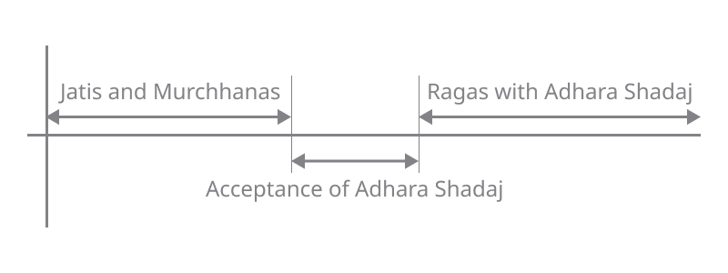

import scaleBasicIntervals from './basicIntervals.pkb'
import scaleSamaGana from 'data/default.pkb'

export const notesBasicIntervals = [
    {white: "Sa", black: "fade"},
    {white: "fade", black: "fade"},
    {white: "Ga"},
    {white: "ma", black: "fade"},
    {white: "Pa", black: "fade"},
    {white: "fade", black: "fade"},
    {white: "fade"},
    {white: "SA"}
]

Indian Classical Music was not always like we know and understand today, having [evolved continuously](/learn/historical-milestones/) over a period of 2000 - 3000 years. Despite the long evolution, it has retained its fundamental identity and principles. In an [earlier article](/learn/what-is-classical/), we talked about how the intertwined evolution of
*Lakshya*
(presentation) and
*Lakshana*
(grammar) have lent Indian Classical Music its distinctive identity. We look at [Lakshanas](/learn/grammar-of-music/) in a later article, but first we need to understand a key milestone in Indian Classical music - the adoption of Adhara Shadaj.

## Adoption of Adhara Shadaj

If one were to divide the evolution of Indian classical music into different eras, the introduction of the concept of
*Adhara Shadaj*
(fixed fundamental tonic) stands out as a major dividing phase. Today, Indian Classical musicians choose a desired pitch for the fundamental note **Sa**. Then all the other notes they play are defined based on their relationship with **Sa**.

In the
*pre-Adhara Shadaj era*,
notes were named based on the pitches of specific strings on harp Veenas, akin to how the keys C, D, E, etc., are named based on the pitches of specific keys on a piano. This is quite in contrast to choosing a desired pitch for **Sa**.

<FigCaption>
Figure 1. A Timeline of Indian Classical Music
</FigCaption>

As part of this major change, Indian music evolved and certain aspects of Lakshya and Lakshana were modified. Some new forms came into place while other forms became obsolete. But many concepts and terminologies were carried over with a different interpretation.

Since we are in the Adhara Shadaj era, let us start by choosing **Sa**. You can use the settings below to set the **Sa** to any pitch you prefer. All the demos on this page would play according to this setting.

<CommonPitch />

## Gram, Murchhana, Jati

Now, to better understand the difference
*Adhara Shadaj*
brought in Indian Classical Music, let us look at the concepts of
*Gram*,
*Murcchana*
and
*Jati*.

Early on in the evolution of Indian Classical Music (maybe, even as early as 3rd-4th century CE), musicians and scholars studying and experimenting in music recognised three very important ratios:
*Pancham Bhav*
or the perfect fifth,
*Madhyam Bhav*
or the perfect fourth and
*Gandhar Bhav*
or the major third which is also known as
*Antara Gandhar*.
Here **Sa** denotes the fundamental and **Ga, ma, Pa** and **SA** denote the Gandhar, Madhyam, Pancham and Dviguna (octave) respectively. Note that the notes here do not match up with today's standard [12 tone equally tempered scale](https://en.wikipedia.org/wiki/12_equal_temperament).

<ScalePlayer title='Demo 1. Basic Intervals' noteSpec={notesBasicIntervals} scale={scaleBasicIntervals} />

<Notice>

**Note:** This article features high quality audio demonstrations which are an integral part of the narrative. For ease of understanding, these demos have been presented in the form of a musical keyboard which many would recognize. Simply click on **Start** to activate and tap a key to play. Please try and use a pair of headphones or good quality speakers to listen to the samples with maximum clarity.
</Notice>

As you can hear from Demo 1, Pancham, Madhyam and Gandhar are pleasant sounding intervals. For the musically inclined, they may be easy to recognise by ear. These ratios formed the basis for division of an octave into notes. With all three ratios recognised, an octave was divided into 22 intervals or subdivisions called
*Shrutis*.
The method of dividing an octave into 22 Shrutis is described by
*Bharat*
in his Lakshanagrantha on performing arts,
*Natya Shastra*,
and also by
*Sarang Dev*
who described it in his Lakshanagrantha on music,
*Sangeet Ratnakar*.

Now, the term
*Gram*
literally means a village - formed by a collection of people from the same community or ethnicity. Applying the same principles, three musical
*Grams*
were created and recognised:
*Shadaj Gram*,
*Madhyam Gram*
and
*Gandhar Gram*
which respectively emphasized the
*Pancham Bhav*,
*Madhyam Bhav*
and
*Gandhar Bhav*.
Just like a real life
*Gram*
had people similar to one another, the notes of a musical
*Gram*
were supposed to be related and to be in consonance with one other. In practical terms, a
*Gram*
signified a specific system of tuning on the harp Veena. For more details, see these two posts on
*Shadaj Gram*
([1](/learn/tuningsystems-2/) and [2](/learn/tuningsystems-3/)).

The term
*Murchhana*
comes from the word
*Murchh*
which literally means "to increase". So an increasing or ascending collection of seven successive notes is defined as a
*Murchhana*.
Note that the consonance of notes in a
*Murchhana*
is assumed, and it is always derived from a
*Gram*.
You could start with any note in a
*Gram*
and pick seven successive ascending notes and form a
*Murchhana*.
In other words, a mode or a cyclical permutation of a
*Gram*
was termed a
*Murcchana*.
These
*Murchhanas*
formed the basis for
*Jatis*
and modern day
*Ragas*.

## Jatis, Ragas and Adhara Shadaj

Let us understand this with an example using present day notation for ease of explanation. Let us denote the 12 musical notes in an octave as follows:

**Sa re Re ga Ga ma Ma Pa dha Dha ni Ni SA**

where notes beginning with a lower case denote
*Komal*
or flat notes, notes beginning with an upper case denote
*Tivra*
or sharp notes and **SA** denotes the octave of **Sa**. You can listen to these 12 notes as per the [tuning system](/learn/tuningsystems-4/) of
*Ramamatya*
and
*Venkatamakhin*
in Demo 2. We have covered Indian tuning systems in these posts: [1](/learn/tuningsystems-1/), [2](/learn/tuningsystems-2/), [3](/learn/tuningsystems-3/) and [4](/learn/tuningsystems-4/).

export const noteSpec = [
    {white: "Sa", black: "re"},
    {white: "Re", black: "ga"},
    {white: "Ga"},
    {white: "ma", black: "Ma"},
    {white: "Pa", black: "dha"},
    {white: "Dha", black: "ni"},
    {white: "Ni"},
    {white: "SA"}
]

<ScalePlayer title='Demo 2. Venkatamakhin-Ramamatya Tuning' noteSpec={noteSpec} scale={scaleSamaGana} />

Let us take a well known scale today: the scale of Raga
*Shanakarabharanam*
or
*Bilawal*. 

**Sa Re Ga ma Pa Dha Ni SA**

Listen to this scale in Demo 3.

<MotifPlayer title='Demo 3. Shankarabharanam Scale' motif={`Sa Re Ga ma Pa Dha Ni SA 2 \nSA Ni Dha Pa ma Ga Re Sa 2`} scale={scaleSamaGana} />

Now, let us perform a scale change by starting from **ma** and go up to its octave. Listen to the scale change in Demo 4.

<MotifPlayer title='Demo 4. Shankarabharanam Scale from ma to ma"' motif={`ma Pa Dha Ni SA Re" Ga" ma" 2 \nma" Ga" Re" SA Ni Dha Pa ma 2`} scale={scaleSamaGana} />

Now let us rewrite this scale by transposing **ma** to **Sa** while maintaining the intervals between the notes. The transposed scale would be:

**Sa Re Ga Ma Pa Dha Ni SA**

which is nothing but Raga
*Kalyani*
or
*Yaman*.
Listen to the transposed scale in Demo 5.

<MotifPlayer title='Demo 5. Kalyani Scale' motif={`Sa Re Ga Ma Pa Dha Ni SA 2 \nSA Ni Dha Pa Ma Ga Re Sa 2`} scale={scaleSamaGana} />

Hear Demo 4 and Demo 5 a few times, and try to match the scales. This shifting of scale to derive another scale is also known as **Graha Bheda**.

So what do we learn about
*Jatis*
and
*Ragas*
from this example?

Well, in the era prior to
*Adhara Shadaj*
when the concept of a fixed fundamental **Sa** did not exist, new scales were formed by performing scale changes and defining new
*Murchhanas*.
From a
*Murchhana*,
a
*Jati*
was defined as a melodic framework formed by selecting 5 to 7 notes, and defining Lakshanas and Lakshyas governing the rendition of the
*Jati*.
Jatis could be
*Sampoorna*
(using all 7 notes of the Murchhana),
*Shadav*
(hexatonic) or
*Audava*
(pentatonic).

With the acceptance of
*Adhara Shadaj*,
the Jatis were denoted by transposing their starting note back to **Sa** and they became what we today call as
*Ragas*.

Taking the above example, in today's music, both Shankarabharanam and Kalyani would be performed to the same fundamental tonic or
*Adhara Shadaj*,
whereas earlier they would have been perfomed with a scale shift (Shankarabharanam from **Sa** and Kalyani from **ma**).

## Summary

To summarize, in the
*pre-Adhara Shadaj era*,
notes were named based on the pitches of specific strings on harp Veenas, akin to how the keys C, D, E, etc., are named based on the pitches of specific keys on a piano. A specific system of tuning on the harp Veena was termed a
*Gram*
and a mode or cyclical permutation of a
*Gram*
was termed a
*Murcchana*.
The closest equivalent to the modern concept of
*Raga*
was the notion of
*Jati* -
a musical scale with a set of Lakshana and Lakshya. Jatis were regarded as consistent and distinct recognisable entities much like Ragas are today.

Lakshanas in Indian Classical music have been carried over from Jatis to Ragas. We look at them closely in the [next article](/learn/grammar-of-music/).

*(Originally published by S Balachander over at [Chandraveena](https://www.chandraveena.com/blog/grammar-of-music/).)*