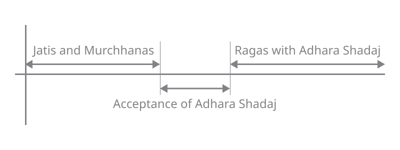

import scaleBasicIntervals from './basicIntervals.pkb'
import scaleSamaGana from 'data/default.pkb'

export const notesBasicIntervals = [
    {white: "Sa", black: "fade"},
    {white: "fade", black: "fade"},
    {white: "Ga"},
    {white: "ma", black: "fade"},
    {white: "Pa", black: "fade"},
    {white: "fade", black: "fade"},
    {white: "fade"},
    {white: "SA"}
]

Indian Classical Music was not always like we know and understand today, having [evolved continuously](/learn/historical-milestones/) over a period of 2000 - 3000 years. Despite the long evolution, it has retained its fundamental identity and principles. In an [earlier article](/learn/what-is-classical/), we talked about how the intertwined evolution of *Lakshya* (presentation) and *Lakshana* (grammar) have lent Indian Classical Music its distinctive identity. Now let us take a closer look at Lakshanas.

## Reference Pitch, Basic Intervals and Ratios

First let us start with the concept of the fundamental note **Sa**. In Indian Classical music, all musical notes are defined based on their relationship with **Sa**. You can use the settings below to set the **Sa** to any pitch you prefer. All the demos on this page would play according to this setting.

<CommonPitch />

## Lakshanas in Indian Classical Music

Like with any language, even for music, a grammatical framework is essential for effective communication and consistent understanding. In Indian Classical music, treatises on musical grammar and rules are called *Lakshanagranthas* (books of grammar), which have evolved and developed over many centuries. Lakshanagranthas deal primarily with Lakshanas, although they do talk about Lakshya as well.

<FigCaption>
Figure 1. A Timeline of Indian Classical Music
</FigCaption>

If one were to divide the evolution of Indian classical music into different eras, the introduction of the concept of *Adhara Shadaj* (fixed fundamental tonic) stands out as a major dividing phase. You may have selected a key and an offset from the `Common Parameters` above. In contrast to choosing a desired pitch for **Sa**, in the pre-Adhara Shadaj era, notes were named based on the pitches of specific strings on harp Veenas, akin to how the keys C, D, E, etc., are named based on the pitches of specific keys on a piano.

As part of this major change, Indian music evolved and certain aspects of Lakshya and Lakshana were modified. Some new forms came into place while other forms became obsolete. But many concepts and terminologies were carried over with a different interpretation.

## Gram, Murchhana, Jati

Now, to better understand the difference *Adhara Shadaj* brought in Indian Classical Music, let us look at the concepts of *Gram*, *Murcchana* and *Jati*.

Early on in the evolution of Indian Classical Music (maybe, even as early as 3rd-4th century CE), musicians and scholars studying and experimenting in music recognised three very important ratios: *Pancham Bhav* or the perfect fifth, *Madhyam Bhav* or the perfect fourth and *Gandhar Bhav* or the major third which is also known as *Antara Gandhar*. Here **Sa**  denotes the fundamental and **Ga, ma, Pa** and **SA** denote the Gandhar, Madhyam, Pancham and Dviguna (octave) respectively. Note that the notes here do not match up with today's standard [12 tone equally tempered scale](https://en.wikipedia.org/wiki/12_equal_temperament).

<ScalePlayer title='Demo 1. Basic Intervals' noteSpec={notesBasicIntervals} scale={scaleBasicIntervals} />

<Notice>

**Note:** This article features high quality audio demonstrations which are an integral part of the narrative. For ease of understanding, these demos have been presented in the form of a musical keyboard which many would recognize. Simply click on **Start** to activate and tap a key to play. Please try and use a pair of headphones or good quality speakers to listen to the samples with maximum clarity.
</Notice>

As you can hear from Demo 1, Pancham, Madhyam and Gandhar are pleasant sounding intervals. For the musically inclined, they may be easy to recognise by ear. These ratios formed the basis for division of an octave into notes. With all three ratios recognised, an octave was divided into 22 intervals or subdivisions called *Srutis*. The method of dividing an octave into 22 Srutis is described by *Bharat* in his Lakshanagrantha on performing arts, *Natya Shastra*, and also by *Sarang Dev* who described it in his Lakshanagrantha on music, *Sangeet Ratnakar*.

Now, the term *Gram* literally means a village - formed by a collection of people from the same community or ethnicity. Applying the same principles, three musical *Grams* were created and recognised: *Shadaj Gram*, *Madhyam Gram* and *Gandhar Gram* which respectively emphasized the *Pancham Bhav*, *Madhyam Bhav* and *Gandhar Bhav*. Just like a real life *Gram* had people similar to one another, the notes of a musical *Gram* were supposed to be related and to be in consonance with one other.

The term *Murchhana* comes from the word *Murchh* which literally means "to increase". So an increasing or ascending collection of seven successive notes is defined as a *Murchhana*. Note that the consonance of notes in a *Murchhana* is assumed, and it is always derived from a *Gram*. You could start with any note in a *Gram* and pick seven successive ascending notes and form a *Murchhana*. These *Murchhanas* formed the basis for *Jatis* and modern day *Ragas*.

## Jatis, Ragas and Adhara Shadaj

Let us understand this with an example using present day notation for ease of explanation. Let us denote the 12 musical notes in an octave as follows:

**Sa re Re ga Ga ma Ma Pa dha Dha ni Ni SA**

where notes beginning with a lower case denote *Komal* or flat notes, notes beginning with an upper case denote *Tivra* or sharp notes and **SA** denotes the octave of **Sa**. You can listen to these 12 notes as per the [tuning system](/learn/tuningsystems-4/) of *Ramamatya* and *Venkatamakhin* in Demo 2. We have covered Indian tuning systems in these posts: [1](/learn/tuningsystems-1/), [2](/learn/tuningsystems-2/), [3](/learn/tuningsystems-3/) and [4](/learn/tuningsystems-4/).

export const noteSpec = [
    {white: "Sa", black: "re"},
    {white: "Re", black: "ga"},
    {white: "Ga"},
    {white: "ma", black: "Ma"},
    {white: "Pa", black: "dha"},
    {white: "Dha", black: "ni"},
    {white: "Ni"},
    {white: "SA"}
]

<ScalePlayer title='Demo 2. Venkatamakhin-Ramamatya Tuning' noteSpec={noteSpec} scale={scaleSamaGana} />

Let us take a well known scale today: the scale of Raga *Shanakarabharanam* or *Bilawal*. 

**Sa Re Ga ma Pa Dha Ni SA**

Listen to this scale in Demo 3.

<MotifPlayer title='Demo 3. Shankarabharanam Scale' motif={`Sa Re Ga ma Pa Dha Ni SA 2 \nSA Ni Dha Pa ma Ga Re Sa 2`} scale={scaleSamaGana} />

Now, let us perform a scale change by starting from **ma** and go up to its octave. Listen to the scale change in Demo 4.

<MotifPlayer title='Demo 4. Shankarabharanam Scale from ma to ma"' motif={`ma Pa Dha Ni SA Re" Ga" ma" 2 \nma" Ga" Re" SA Ni Dha Pa ma 2`} scale={scaleSamaGana} />

Now let us rewrite this scale by transposing **ma** to **Sa** while maintaining the intervals between the notes. The transposed scale would be:

**Sa Re Ga Ma Pa Dha Ni SA**

which is nothing but Raga *Kalyani* or *Yaman*. Listen to the transposed scale in Demo 5.

<MotifPlayer title='Demo 5. Kalyani Scale' motif={`Sa Re Ga Ma Pa Dha Ni SA 2 \nSA Ni Dha Pa Ma Ga Re Sa 2`} scale={scaleSamaGana} />

Hear Demo 4 and Demo 5 a few times, and try to match the scales. This shifting of scale to derive another scale is also known as **Graha Bheda**.

So what do we learn about *Jatis* and *Ragas* from this example?

Well, in the era prior to *Adhara Shadaj* when the concept of a fixed fundamental **Sa** did not exist, new scales were formed by performing scale changes and defining new *Murchhanas*. From a *Murchhana*, a *Jati* was defined as a melodic framework formed by selecting 5 to 7 notes, and defining Lakshanas and Lakshyas governing the rendition of the *Jati*. Jatis could be *Sampoorna* (using all 7 notes of the Murchhana), *Shadav* (hexatonic) or *Audava* (pentatonic).

With the acceptance of *Adhara Shadaj*, the Jatis were denoted by transposing their starting note back to **Sa** and they became what we today call as *Ragas*.

Taking the above example, in today's music, both Shankarabharanam and Kalyani would be performed to the same fundamental tonic or *Adhara Shadaj*, whereas earlier they would have been perfomed with a scale shift (Shankarabharanam from **Sa** and Kalyani from **ma**).

Now let us take a few examples of Lakshanas, and see what they mean and how they evolved across these period. For ease of understanding, let us group the Lakshanas into those pertaining to: (a) the importance of *Swaras* or individual notes; (b) the timing and usage of Swaras; and (c) musical phrases and scales.

## Types of Swaras

-   **Graha**: In the pre-Adhara Shadaj days, the *Graha* (home) swar was a very important concept and reference for a musical performance. This was because it was the Graha swar which was the starting note defining the Murchhana. Like in the example above, the Graha swar determined whether the scale being performed was Shankarabharanam or Kalyani (refer to Demos 3, 4 and 5). But today, however, the *Sa* is the Graha swar for all Ragas.
-   **Vadi, Samvadi**: In today's understanding of music, *Vadi* denotes the most important note of the Raga, and *Samvadi* as the second most important note of the Raga. However, *Vadi* means a speaking note, or any note of the Raga. *Samvadi* is a consonant note of the Vadi note which is generally its fourth (Madhyam bhav) or its fifth (Pancham bhav) (refer to Demo 1).
-   **Anuvadi**: *Anuvadi* is a note descibed as being in harmony, typically the third (Tivra Gandhar or Komal Gandhar) of a note (refer to Demo 1).
-   **Vivadi**: *Vivadi* literally means a contesting or argumentative. Musically, it means a note so close to the original that one can see the tension between the notes. To illustrate Vivadi notes, we take an example of a scale which is used for [*Sama Gana*](/learn/tuningsystems-1/) (recitation of *Sama Veda*), and can be considered equivalent to today's Raga Kharaharapriya. The scale is: **Sa Re ga ma Pa Dha ni SA** which you can hear in Demo 6.

<MotifPlayer title='Demo 6. Sama Gana Scale with Vivadi intervals Re-ga and Dha-ni' motif={`Sa Re ga ma Pa Dha ni SA 2 \nSA ni Dha Pa ma ga Re Sa 2`} scale={scaleSamaGana} />

Lakshanagranthas describe two successive notes which are less than two Srutis apart as Vivadi notes, specifically  **Re** and **ga** as well as **Dha** and **ni** in the above scale.

-   **Amsa**: The most often used note is called *Amsa*. Amsa literally a man's shoulder or a bull's hump. Musically, it means the note that shoulders the weight of the Raga.
-   **Nyasa**: *Nyasa* is a halting note of a musical phrase. It could be a Samvadi or Anuvadi of the starting note of the musical phrase, or the Amsa note of the Raga. The concepts of Amsa and Nyasa are best illustrated in [Raga Alapana](https://www.chandraveena.com/blog/raga-alapana/).

## Timing and Usage of Swaras

Swaras are also classified based upon their timing and frequency of usage.

-   **Alpatva**: An *Alpatva* note is one which is rarely and fleetingly used note.
-   **Bahutva**: A *Bahutava* note is one which is often used. Graha and Amsa notes are generally Bahutva notes. Check this [Pallavi in Raga Jaunpuri](https://www.youtube.com/watch?v=sldH_5uYvqc). Here, **ga** (Komal Gandhar) is Alpatva and **Sa** (Shadaj) is Bahutva.
-   **Hrasva**: A *Hrasva* note is one on which a musical phrase does not linger for a length of time.
-   **Deergha**: A *Deergha* note is one where a musical phrase can halt for a considerable time. Check this [Pallavi in Raga Bhairavi](https://www.youtube.com/watch?v=z4lz4pmswkw). Here, **re** is Hrasva and **Pa** is Deergha.
-   Hrasva and Deergha are also applicable in lyrical compositions where they mean short vowels and long vowels. This is best illustrated in a Pallavi. Stay tuned for a post on the topic.

## Musical Phrases and Scales

Lakshanas also govern the formation of musical phrases and scales.

-   **Aarohi**: An *Aarohi* phrase is an ascending set of notes. For example, **Sa Re Ga ma Pa**.
-   **Avarohi**: An *Avarohi* phrase is a descending set of notes. For example, **Dha Pa ma Ga Re**.
-   **Sthayi**: *Sthayi* literally means constant. Musically, it refers to a fixed note around which musical phrases revolve. A Sthayi is used in the context of a musical phrase or to define an octave. A few examples of Sthayi phrases (taking **Sa** as the Sthayi note) in Raga Shankarabharnam are: **Sa Re Ga ma Pa Dha Ni SA**, **Sa Re Sa** and **Sa Re SA** which you can hear in Demo 7.

<MotifPlayer title='Demo 7. Sthayi phrases in the scale of Raga Shankarabharanam' motif={`Sa Re Ga ma Pa Dha Ni SA 2 \nSa Re Sa 2 \nSa Re SA 2`} scale={scaleSamaGana} />

-   **Melakarta and Janaka Raga**: A *Melakarta* Raga or a *Janaka* Raga is a parent Raga from which other Ragas are derived. Melakarta Ragas are always heptatonic. Janaka Raga could be heptatonic or have fewer notes. For example, Raga Shankarabharanam from Demo 5 is an example of a Melakarta or Janaka Raga.
-   **Janya Raga**: A *Janya* Raga is a derived Raga from a Melakarta or a Janaka Raga. The derived scale could be Sampoorna (heptatonic), Shadava (hexatonic) or Oudava (pentatonic). Also, note that Janya Ragas can be asymmetric. For example, it could be Audava while ascending and Shadava while descending. Other combinations of Aarohi and Avarohi patterns are also possible. For example, by dropping ma and Dha from Raga Shankarabharnam, Raga Hamsadhwani can be created as a Janya Raga with the scale: **Sa Re Ga Pa Ni SA** which you can hear in Demo 8.

<MotifPlayer title='Demo 8. Hamsadhwani scale as a Janya of Shankarabharanam.' motif={`Sa Re Ga Pa Ni SA 2 \nSA Ni Pa Ga Re Sa 2`} scale={scaleSamaGana} />

Compare Demo 3 and Demo 8, and make your observations. Note that it may be possible to derive the same Janya scale from another Melakarta. This is an aesthetic choice (Lakshya) based on how an artist wishes to present the Janya Raga.

## Summary

To summarize, a *Raga* is a concept originating from *Jati* and can be defined as a musical scale, together with a set of Lakshanas and Lakshya which results in a consistent, recognisable musical framework. Within the reference of a Raga, an artist can attempt to improvise and develop the Raga through a musical performance.

Now for a given Raga, each of these Lakshanas mentioned above are clearly defined. Through a cycle of listening, learning, practicing and performing, a student can learn the Lakshana aspect of a given Raga as well. However, these only define the framework and by themselves do not make music. An artist has to apply Lakshya to their rendition and create a Raga presentation which can be described as *Ranjayati* (that which illuminates, gratifies and colours the mind). This is the most important characteristic in the presentation of a Raga.

*(Originally published by S Balachander over at [Chandraveena](https://www.chandraveena.com/blog/grammar-of-music/).)*