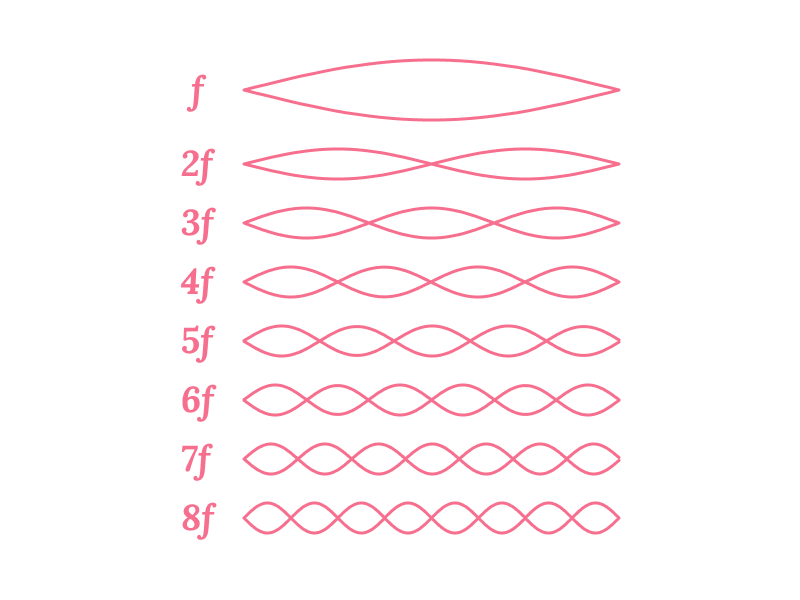

import sixteenHarmonics from './16harmonics.dsp'
import twoCloseTones from './Two-close-tones.dsp'
import twoCloseStrings from './Two-close-strings.dsp'
import tanpuraString from './tanpura-string.dsp'

The Tanpura (also referred to as **Tambura**) is a musical instrument with an intriguing and also fundamental place in today's Indian Classical music. As you may well know, it is not a lead instrument on which a melody is played. Rather it is used as a background instrument to create a drone accompaniment through the repetitive plucking of four open strings. It is relatively new to Indian Classical music, having reached its modern form sometime around 1700 CE. But it has influenced Indian Classical music quite profoundly, including both the common styles of Hindustani and Carnatic music. To understand what came before it, it may help you to read about the pre-Tanpura tuning systems ([1](/learn/tuningsystems-1/), [2](/learn/tuningsystems-2/), [3](/learn/tuningsystems-3/) and [4](/learn/tuningsystems-4/)) used in Indian Classical music and also the evolution of [Indian musical scales](/learn/musicalscales/) in related articles.

In this article, we focus on the Tanpura, its unique sound and how it affects the tuning and rendition of Indian Classical music. Contrary to widely held perceptions, the Tanpura is not only responsible for providing a reference of the fundamental note **Sa**, but it actually provides a tuning system resulting from string overtones which supports the entire Raga being performed. Skilled and sensitive artists can tune a Tanpura with such subtlety as to leave an unmistakeable impression of the Raga they perform. To understand this better, we need to start with how a Tanpura works.

## Reference Pitch, Basic Intervals and Ratios

Before we begin, let us start with the concept of the fundamental note **Sa**. In Indian Classical music, all musical notes are defined based on their relationship with **Sa**. You can use the settings below to set the **Sa** to any pitch you prefer. All the demos on this page would play according to this setting.

<CommonPitch />

<Notice>

**Note:** This article features high quality audio demonstrations which are an integral part of the narrative. Please try and use a pair of headphones or good quality speakers to listen to the samples with maximum clarity.
</Notice>

## Basic Working of a Tanpura

Let us start by listening to a short sample of a Tanpura, to appreciate its rich and characteristic sound. This Tanpura is set to the key of C, with its four strings tuned as **Pa** - **SA** - **SA** - **Sa**, where Sa denotes the fundamental, Pa the fifth and SA the octave. As you can hear, the Tanpura has a very distinctive sound which is quite different from other string instruments you may have heard.

<Audio src="/Samples/01-Tanpura-Sample.mp3" caption="/Samples/01-Tanpura-Sample.vtt" />

<FigCaption>
Demo 1. A short recording of a Tanpura
</FigCaption>

A Tanpura (see Figure 1) has a long stem which is attached to a soundboard and a round resonating enclosure. The stem and soundboard are generally made of wood, while the resonator may be made from the shell of a pumpkin or gourd, or from wood. The Tanpura has four strings with their tuning pegs at the top end. They pass over a smooth round bridge and are attached to the base of the instrument. In addition to the tuning pegs at the top, each string has small fine tuning beads below the bridge. Finally, a cotton thread is passed between the strings and their contact point on the bridge. Using the tuning pegs, the fine tuning beads and the position of the thread on the bridge, an expert artist can finely tune the Tanpura to create just the right sound needed for their musical rendition.

<FigCaption>
Figure 1. Structure of a Tanpura
(Picture courtesy of <a href="https://www.flickr.com/photos/91676597@N07/8325869555">Alex Lenovski</a> used under <a href="https://creativecommons.org/licenses/by/2.0/">CC BY 2.0</a>, Labels by Aravind Iyer)
</FigCaption>

## The Sound of a String

There has been a lot of research into the sound of the Tanpura, starting from C. V. Raman in 1921 till the present times. Subsequently, there have been a number of works which have investigated the phenomenon of how a Tanpura string vibrates and produces sound. But before we attempt to explain the Tanpura sound, we need to look at a generic string and how it vibrates. Consider a string stretched across two points of contact. If the string is plucked, then how would it vibrate? It turns out that the string vibrates in a combination of the following modes of vibration.

<FigCaption>
Figure 2. Modes of Vibration in a Vibrating String
</FigCaption>

It may look strange but really the string is vibrating in all of those ways at the same time. If you have a look at the vibrating string side on, what you see visually is the string vibrate in a combination of these modes of vibration. Not all of the modes vibrate with the same amount of intensity though. The most fundamental mode of vibration is the one labelled $f$ with the single peak right in the middle. This is the most dominant mode of vibration. The intensity of vibration progressively decreases as you go to higher modes of vibration, $2f$, $3f$, $4f$, etc.

Now each mode corresponds to a different pitch, with the mode $2f$ at twice the frequency as $f$, $3f$ at thrice the frequency as $f$ and so on as the labels indicate. What we hear is the cumulative sound of all of those pitches playing out at different intensities. Since $f$ is the loudest (or most dominant), our ears perceive the overall pitch to be $f$ and the higher modes of vibration lend the string sound its character or what is called the timbre.

These modes of vibration are also referred to as overtones or harmonics. They play a key role in giving rise to the characteristic Tanpura sound. Listen to the demonstration below to hear the different harmonics of a string. The demonstration plays the harmonics in sequence from $f$ all the way to $16f$ and then back again. If we take $f$ to be the note **Sa**, then can you identify which note each harmonic corresponds to?

<MotifPlayer title='Demo 2. First 16 Harmonics of a String' motif='For each harmonic, can you identify which note it corresponds to?' staticCode={sixteenHarmonics} />

## Perception of Pitch and Interactions between Pitches

We need to talk about an important mathematical equation which is key to explaining the Tanpura sound.

$$\sin(2\pi f_1t) + \sin(2\pi f_2t) = 2\sin\left(2\pi{f_1+f_2 \over 2}t\right)\cos\left(2\pi{f_1-f_2 \over 2}t\right)$$

For the less mathematically inclined, $\sin(2\pi f_1t)$ represents a signal which is oscillating or vibrating at a frequency $f_1$. Those who know their mathematics may recognize that this is just a basic identity in Trigonometry.

So what this equation says is that when we hear two signals vibrating at $f_1$ and $f_2$ at the same time, it can also be regarded as hearing the product of two signals vibrating at the average and half the difference of the two frequencies, i.e., at ${f_1+f_2 \over 2}$ and ${f_1-f_2 \over 2}$ respectively.

Now think about the case where the frequencies $f_1$ and $f_2$ are so close that the difference is near the limit of human capability to discriminate pitches. At this point, if we were to play a string at $f_1$ and then a string at $f_2$, fewer and fewer people would be able to tell them apart as different pitches, as the pitches get closer and closer.

In such a situation, when $f_1$ and $f_2$ are played together, we would hear it as a signal at the average pitch ${f_1+f_2 \over 2}$ (which again is very close to $f_1$ or $f_2$, since they are so close together) and the intensity of this signal would rise and ebb slowly at the rate ${f_1-f_2 \over 2}$.

Listen to the samples below to hear two close frequencies $f_1$ and $f_2$ played separately and together to understand this effect. The pitches $f_1$ and $f_2$ are very close, so you may not be able to tell them apart. Yet, when they are played together, notice how you hear the intensity rise and fall repeatedly as the signal dies out, showing you that they are slightly different.

export const demo3text = `Tone 1 plays on the left.
Tone 2 plays on the right.
Then both tones play together.`

<MotifPlayer title='Demo 3. Two tones close in pitch' motif={demo3text} staticCode={twoCloseTones} />

Here is another set of samples of two close frequencies $f_1$ and $f_2$ played separately and together. Unlike the previous case where the samples consisted of tones, here you can hear a richer string-like sound. This time, when the signals are played together, what do you hear in addition to the intensity fluctuations you heard previously? In the background, in higher registers, you may be able to hear the overtones also peaking and falling.

export const demo4text = `String 1 plays on the left.
String 2 plays on the right.
Then both strings play together.`

<MotifPlayer title='Demo 4. Two strings close in pitch' motif={demo4text} staticCode={twoCloseStrings} />

You can also try playing Demo 4 together with Demo 2 to see if you can hear a faint hint of the overtones in Demo 4. Another thing you may observe is how well in-tune Demo 2 appears with Demo 4.

## A Tanpura String

We learned two concepts so far: vibrating modes of a string or harmonics; and what happens when two pitches very close together are played at the same time. We need to understand three more points and then we would be ready to put things together to explain the sound an individual Tanpura string produces.

### Vibrating Length and Pitch

The length of the string determines the pitch of the string. To be a bit more precise, two strings which are stretched to the same level of tension would vibrate at pitches inversely proportional to their vibrating lengths. For example, a string which is half the length of a second string, would vibrate at twice the pitch of the second string.

### Rounded Bridge and Length Variation

The role of the rounded bridge in a Tanpura is to spread the point of contact between the string and the bridge. This results in the vibrating length of the string changing ever so slightly as the string vibrates. This in turn causes the pitch of the string to modulate slightly as it vibrates.

### Cotton Thread and Sharpness

A side-effect of a rounded bridge is that the string grazes against the bridge more than it would with a pointier bridge. This results in a duller sound which dissipates more quickly. The role of the cotton thread is to restore the sharpness and to sustain the sound.

Overall, the combination of the rounded bridge and the cotton thread in the Tanpura, achieve the effect of maintaining the sharpness and sustain of a pointy bridge while also allowing the vibrating length to change subtly as the string vibrates.

### Putting it all together

We know that if the vibrating length changes, the pitch of the string would also change. In the case of a Tanpura string, this effectively results in the string playing at two slightly different pitches simultaneously. If we denote by $\Delta f$, the difference in pitches because of the changing vibrating length, we hear two close pitches $f+\Delta f$ and $f-\Delta f$, where $f$ is the pitch of the string.

We also know that if these two signals are played simultaneously, we would perceive their amplitude to periodically ebb and rise at the rate ${f_1-f_2 \over 2}$ which is $\Delta f$. This is true not only for the fundamental mode of vibration $f$, but also for each of the overtones $2f$, $3f$ and so on which occur concurrently. Thus, $f$ rises and falls at the rate $\Delta f$, $2f$ at the rate $2\Delta f$, $3f$ at $3\Delta f$ and so on.

Unlike a generic string, where the fundamental $f$ overshadows the higher harmonics, in a Tanpura, each harmonic peaks in intensity at different times, enabling us to hear each of them separately in quick succession. Much like a prism splitting white light into its constituent rainbow colours, the bridge and thread of the Tanpura split apart the harmonics of each string.

Recall the first 16 harmonics from Demo 2. According to our explanation, we should be able to hear all those harmonics play one after the other in a single Tanpura string.

export const demo5text = `Try and see if you can hear individual overtones peaking and decaying in succession.`

<MotifPlayer title='Demo 5. A Model of a Tanpura String' motif={demo5text} staticCode={tanpuraString} />

## Summary

We covered different aspects of the sound of a Tanpura. We looked at it from the perspective of its construction and saw how each string of a Tanpura emits a dispersion of its constituent harmonics. We also looked at it from a musical perspective and saw how an appropriately tuned Tanpura can support a desired Raga or musical scale. As patrons of Indian Classical music would know, the sense of accuracy which comes from an artist and a well-tuned Tanpura being perfectly in sync with each other, can create an unmistakeable feeling of a Raga. Indian Classical musicians today no longer uses historical tuning systems, but rely on the Tanpura to provide the musical space and support for their music. So it is no exaggeration to say that the Tanpura is the cornerstone of today's Indian Classical music.

In related articles, we cover the pre-Tanpura tuning systems ([1](/learn/tuningsystems-1/), [2](/learn/tuningsystems-2/), [3](/learn/tuningsystems-3/) and [4](/learn/tuningsystems-4/)) used in Indian Classical music and also the evolution of [Indian musical scales](/learn/musicalscales/). These articles should provide more context for the other facets of the musical process depicted in Figure 3.