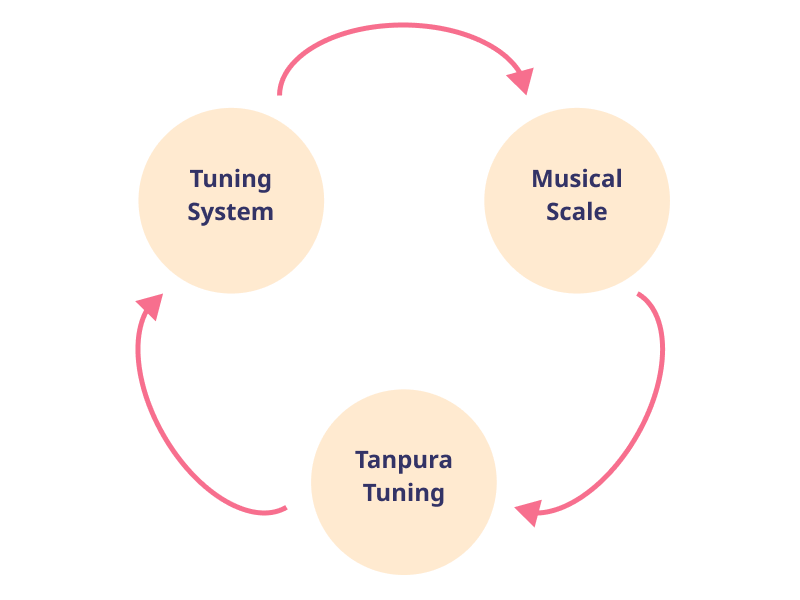

import droneSamaGana from 'data/default.prt'
import scaleSamaGana from 'data/default.pkb'
import droneShadajGram from '../musicalscales/shadajgram.prt'
import scaleShadajGram from '../musicalscales/shadajgram.pkb'

In the [previous article](/learn/tanpuraworking-1/), we looked at the Tanpura from the perspective of sound and showed how the clever combination of the rounded bridge and the cotton thread causes each string to emit its harmonics sequentially. 

Thus it actually provides a tuning system resulting from all the string overtones and can support an entire Raga. Skilled and sensitive artists can tune a Tanpura with such subtlety as to leave an unmistakeable impression of the Raga they perform. We investigate this aspect in this article.

## Reference Pitch, Basic Intervals and Ratios

Before we begin, let us start with the concept of the fundamental note **Sa**. In Indian Classical music, all musical notes are defined based on their relationship with **Sa**. You can use the settings below to set the **Sa** to any pitch you prefer. All the demos on this page would play according to this setting.

<CommonPitch />

<Notice>

**Note:** This article features high quality audio demonstrations which are an integral part of the narrative. Please try and use a pair of headphones or good quality speakers to listen to the samples with maximum clarity.
</Notice>

## The Tuning System from String Overtones

So far, we have looked at the Tanpura from the perspective of sound analysis. What about the musical perspective? To address the musical perspective, let us first understand the musical scale which results from the harmonics you heard in Demo 2. Consider a Tanpura tuned as **Pa** - **SA** - **SA** - **Sa**. Now consider the overtones emanating from the Sa and Pa strings. In Table 1 and Table 2 below, we list some of these harmonics and the notes corresponding to them.

<Caption>
Table 1. Harmonics from Sa
</Caption>

| Harmonic | Ratio | Symbolic Ratio | Note |
| --- | --- | --- | --- |
| 8 | 1 | 1 | Sa |
| 9 | 1.125 | 9/8 | Re |
| 10 | 1.25 | 5/4 | Ga (Antara Gandhar) |
| 11 | 1.375 | 11/8 | ma (Sharp ma) |
| 12 | 1.5 | 3/2 | Pa |
| 13 | 1.625 | 13/8 | dha (Sharp dha) |
| 14 | 1.75 | 7/4 | ni (Flat ni) |
| 15 | 1.875 | 15/8 | Ni (Kakali Nishad) |
| 16 | 2 | 2 | SA |

<Caption>
Table 2. Harmonics from Pa
</Caption>

| Harmonic | Ratio | Symbolic Ratio | Note |
| --- | --- | --- | --- |
| 8 | 1.5 | 3/2 | Pa |
| 9 | 1.6875 | 27/16 | Dha |
| 10 | 1.875 | 15/8 | Ni (Kakali Nishad) |
| 11 | 1.03125 | 33/16 | re (flat re) |
| 12 | 1.125 | 9/8 | Re |
| 13 | 1.21875 | 39/32 | ga (Sharp ga) |
| 14 | 1.3125 | 21/16 | ma (Flat ma) |
| 15 | 1.40625 | 45/32 | Ma (Flat Ma) |
| 16 | 1.5 | 3/2 | Pa |

Thus, a Tanpura tuned as **Pa** - **SA** - **SA** - **Sa** creates a tuning system consisting of the notes in Table 1 and 2. If an artist picks up a Raga based on notes from this tuning system, we should expect that the musical performance and the Tanpura should sound perfectly in tune.

## Sama Gana and Shadaj Gram scales

To illustrate this point better, let us check the case of the Sama Gana scale and the Shadaj Gram scale. For more details on these scales, please check [this article](/learn/tuningsystems-1/) on Indian tuning systems.

Compare and contrast the ratios in Table 1 and 2 with those of the Sama Gana scale listed in Table 3. Observe how Re, Pa and Dha are exactly identical across Tables 1, 2 and 3.

<Caption>
Table 3. Illustration of Sama Gana Scale
</Caption>

| Note | Ratio | Symbolic Ratio |
| --- | --- | --- |
| Sa | 1 | 1 |
| Re | 1.125 | 9/8 |
| ga | 1.185185185 | 32/27 |
| ma | 1.333333333 | 4/3 |
| Pa | 1.5 | 3/2 |
| Dha | 1.6875 | 27/16 |
| ni | 1.777777778 | 16/9 |
| SA | 2 | 2 |

With this understanding, listen to the Tanpura track in Demo 1 which is tuned as **Pa** - **SA** - **SA** - **Sa**. Note how well it supports the Sama Gana scale which you can play from Demo 2.

<DronePlayer title='Demo 1. Drone for Sama Gana Scale' settings={droneSamaGana} />

export const notesSamaGana = [
    {white: "Sa", black: "fade"},
    {white: "Re", black: "ga"},
    {white: "fade"},
    {white: "ma", black: "fade"},
    {white: "Pa", black: "fade"},
    {white: "Dha", black: "ni"},
    {white: "fade"},
    {white: "SA"}
]

<ScalePlayer title='Demo 2. Sama Gana Scale' noteSpec={notesSamaGana} scale={scaleSamaGana} />

Now, consider the Shadaj Gram scale from Table 4 below and see how the notes Re and Dha are different from those in Sama Gana scale. Consequently, these notes are not supported by the Tanpura in Demo 1.

<Caption>
Table 4. Illustration of Shadaj Gram Scale
</Caption>

| Note | Ratio | Symbolic Ratio |
| --- | --- | --- |
| Sa | 1 | 1 |
| Re**♭** | 1.111111111 | 10/9 |
| ga | 1.185185185 | 32/27 |
| ma | 1.333333333 | 4/3 |
| Pa | 1.5 | 3/2 |
| Dha**♭** | 1.666666667 | 5/3 |
| ni | 1.777777778 | 16/9 |
| SA | 2 | 2 |

In order to support the Shadaj Gram scale, the **Sa** string of the Tanpura needs to be tuned down in pitch, so as to support Re**♭** in Shadaj Gram. Listen to Demo 3 for a Tanpura tuned to support Shadaj Gram and observe how it supports the Shadaj Gram scale in Demo 4.

<DronePlayer title='Demo 3. Drone for Shadaj Gram Scale' settings={droneShadajGram} />

export const notesShadajGram = [
    {white: "Sa", black: "fade"},
    {white: "Re♭", black: "ga"},
    {white: "fade"},
    {white: "ma", black: "fade"},
    {white: "Pa", black: "fade"},
    {white: "Dha♭", black: "ni"},
    {white: "fade"},
    {white: "SA"}
]

export const keysShadajGram = {'Sa': 0, 'Re♭': 2, 'ga': 3, 'ma': 5, 'Pa': 7, 'Dha♭': 9, 'ni': 10, 'SA': 12}

<ScalePlayer title='Demo 4. Shadaj Gram Scale' noteSpec={notesShadajGram} keySpec={keysShadajGram} scale={scaleShadajGram} />

In the Tanpura in Demo 3, the **Sa** string has been tuned down in pitch by 14.71 ¢. The harmonics from this detuned Sa string are illustrated in Table 5 below. Note how the 9th harmonic emanating from the Sa string is now very close the intended Re**♭** of the Shadaj Gram scale.

<Caption>
Table 5. Harmonics from Sa - 14.71 ¢
</Caption>

| Harmonic | Ratio | Note |
| --- | --- | --- |
| 9 | 1.115 | Re |
| 10 | 1.239 | Ga |
| 11 | 1.363 | ma |
| 12 | 1.487 | Pa |
| 13 | 1.611 | dha |
| 14 | 1.735 | ni |
| 15 | 1.859 | Ni |

## Musical Process with the Tanpura

The above demonstrations of the Sama Gana scale and the Shadaj Gram scale are just examples. In general, an artist skilled in using a Tanpura can tune a Tanpura for any desired Raga they wish to perform. Artists tend to follow a musical process which is something like Figure 1. An artist may think of a Raga they wish to play. They have to think of the musical scale of this Raga in terms of the relationships between its constituent notes - specifically, which pairs of notes should have a Pancham, Madhyam or Gandhar relationship with each other. With these relationships in mind, the artist tunes the Tanpura so that the tuning system resulting from the overtones of the Tanpura strings supports this musical scale correctly.

<FigCaption>
Figure 1. Musical Process with a Tanpura
</FigCaption>

Alternatively, they may start tuning the Tanpura and observe the tuning system which results from that tuning. From this they may be guided to pick up a musical scale and Raga which is well supported. Thus, a well-tuned tanpura creates the musical space and provides the perfect *Samvad* (consonance) to an appropriately chosen Raga.

## Summary

We covered different aspects of the sound of a Tanpura. In the [previous article](/learn/tanpuraworking-1/), we looked at it from the perspective of its construction and saw how each string of a Tanpura emits a dispersion of its constituent harmonics.

In this article, we looked at it from a musical perspective and saw how an appropriately tuned Tanpura can support a desired Raga or musical scale. As patrons of Indian Classical music would know, the sense of accuracy which comes from an artist and a well-tuned Tanpura being perfectly in sync with each other, can create an unmistakeable feeling of a Raga.

Indian Classical musicians today no longer uses historical tuning systems, but rely on the Tanpura to provide the musical space and support for their music. So it is no exaggeration to say that the Tanpura is the cornerstone of today's Indian Classical music.

In related articles, we cover the pre-Tanpura tuning systems ([1](/learn/tuningsystems-1/), [2](/learn/tuningsystems-2/), [3](/learn/tuningsystems-3/) and [4](/learn/tuningsystems-4/)) used in Indian Classical music and also the evolution of [Indian musical scales](/learn/musicalscales/). These articles should provide more context for the other facets of the musical process depicted in Figure 1.