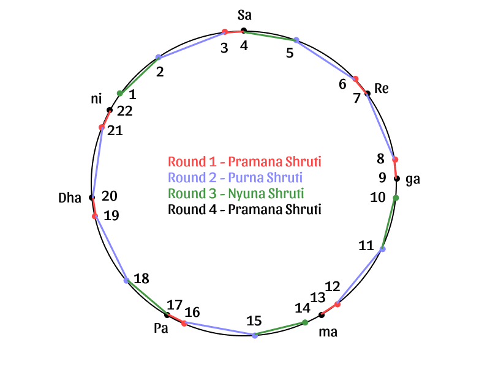

import scaleShadajGramAchal from './shadajGramR0.pkb'
import scaleShadajGramR1 from './shadajGramR1.pkb'
import scaleShadajGramR2 from './shadajGramR2.pkb'
import scaleShadajGramR3 from './shadajGramR3.pkb'
import scaleShadajGramR4 from './shadajGramR4.pkb'

In [part 2](/learn/tuningsystems-2/), we reconstructed the Shadaj Gram scale using two different perspectives and showed the results to be mutually consistent. Shadaj Gram is also quite old, probably dating back [2000 years](/learn/historical-milestones/). In the process of deriving Shadaj Gram from the Sama Gana scale, we came up with useful the musical intervals of Pramana Shruti and the other 2, 3 and 4 Shruti intervals. Music scholars used these intervals to delve deeper into the concepts of consonances and microtones in Indian Classical music. In this part, we will look at the extended 22 Shruti version of the Shadaj Gram scale which can be constructed using these intervals.

Bharat and Sarang Dev in their respective musical treatises, describe a musical experiment involving two harps called the **Achal veena** (*Achal* means non-varying) and the **Chal veena** (*Chal* means varying). By adjusting the pitches of the strings of the Chal veena with respect to the Achal veena, they describe the derivation of a 22 note scale which can be regared as an extended version of Shadaj Gram.

## Reference Pitch, Basic Intervals and Ratios

Before we begin reconstructing any tuning system, let us start with the concept of the fundamental note **Sa**. In Indian Classical music, all musical notes are defined based on their relationship with **Sa**. You can use the settings below to set the **Sa** to any pitch you prefer. All the demos on this page would play according to this setting.

<CommonPitch />

<Notice>

**Note:** This article features high quality audio demonstrations which are an integral part of the narrative. For ease of understanding, these demos have been presented in the form of a musical keyboard which many would recognize. Simply click on **Start** to activate and tap a key to play. Please try and use a pair of headphones or good quality speakers to listen to the samples with maximum clarity.
</Notice>

## Shadaj Gram (22 Shruti Scale)

Let us perform the Bharat-Sarang Dev harp experiment and derive the full 22 shruti scale mathematically. The steps followed in the experiment are given below.

### Achal Veena

Listen to Demo 1 below to familiarize yourself with the Achal Veena scale. This is nothing but the Shadaj Gram scale in Demo 4, but depicted a bit differently. Specifically, the notes are labelled according to their Shruti numbers as per Table 3.

export const notesShadajGramAchal = [
    {white: "4"},
    {white: "7"},
    {white: "9"},
    {white: "13"},
    {white: "17"},
    {white: "20"},
    {white: "22"},
    {white: "4\""}
]

export const keysShadajGramAchal = {'4': 0, '7': 2, '9': 3, '13': 5, '17': 7, '20': 9, '22': 10, '4"': 12}

<ScalePlayer title='Demo 1. Shadaj Gram - Achal Veena' noteSpec={notesShadajGramAchal} keySpec={keysShadajGramAchal} scale={scaleShadajGramAchal} />

### Round 1

-   Round 1 starts by observing (like we mentioned before) that the notes Re♭ and Pa are not consonant.
-   So in Round 1, the Pa (fifth) string of the Chal Veena is set to Shruti #16 which is defined as a Madhyam interval (9 Shrutis) above Shruti #7.
-   Then, each of the other strings are lowered by the ratio of Shruti #17 to Shruti #16. This ratio of Shruti #17 to Shruti #16 is called Pramana Shruti.
-   We can check that this is consistent with the earlier derivation of Pramana Shruti. This is because Shruti #16 is Shruti #7 times the Madhyam ratio which is $\frac{10}{9} \times \frac{4}{3} = \frac{40}{27}$. So, Pramana Shruti is $\frac{3/2}{40/27}=\frac{81}{80}$ as before.

Listen to the Chal Veena scale after Round 1 in Demo 2 below.

export const notesShadajGramR1 = [
    {white: "3"},
    {white: "6"},
    {white: "8"},
    {white: "12"},
    {white: "16"},
    {white: "19"},
    {white: "21"},
    {white: "3\""}
]

export const keysShadajGramR1 = {'3': 0, '6': 2, '8': 3, '12': 5, '16': 7, '19': 9, '21': 10, '3"': 12}

<ScalePlayer title='Demo 2. Shadaj Gram - Round 1' noteSpec={notesShadajGramR1} keySpec={keysShadajGramR1} scale={scaleShadajGramR1} />

<Notice>

**Note:** Again, the Madhyam Gram scale as described by Bharat and by Sarang Dev, has the note Pa♭ at Shruti #16, while the rest of the notes are taken to be the same as in Shadaj Gram. As observed above, this makes the notes Re♭ and Pa♭ consonant with each other.
</Notice>

### Round 2

-   In Round 2, the ga (third) string of the Chal Veena is set to Shruti #7.
-   Then, each of the other strings are lowered by the ratio of Shruti #8 to Shruti #7. This ratio of Shruti #8 to Shruti #7 is called Purna Shruti.
-   We can check that this is consistent with the earlier derivation of Purna Shruti. This is because Shruti #8 is Shruti #9 divided by Pramana Shruti which is $\frac{32/27}{81/80} = \frac{2560}{2187}$. So, Purna Shruti is $\frac{2560/2187}{10/9} = \frac{256}{243}$ as before.

Listen to the Chal Veena scale after Round 2 in Demo 3 below.

export const notesShadajGramR2 = [
    {white: "2"},
    {white: "5"},
    {white: "7"},
    {white: "11"},
    {white: "15"},
    {white: "18"},
    {white: "20"},
    {white: "2\""}
]

export const keysShadajGramR2 = {'2': 0, '5': 2, '7': 3, '11': 5, '15': 7, '18': 9, '20': 10, '2"': 12}

<ScalePlayer title='Demo 3. Shadaj Gram - Round 2' noteSpec={notesShadajGramR2} keySpec={keysShadajGramR2} scale={scaleShadajGramR2} />

### Round 3

-   In Round 3, the re (second) string of the Chal Veena is set to Shruti #4.
-   Then, each of the other strings are lowered by the ratio of Shruti #5 to Shruti #4. This ratio of Shruti #5 to Shruti #4 is called **Nyuna Shruti**.
-   Note that in Round 3, the ga (third) and ni (seventh) string of the Chal Veena are ignored.
-   We can compute the value of Nyuna Shruti as follows. Shruti #5 is Shruti #6 divided by Purna Shruti which itself is Shruti #7 divided by Pramana Shruti. Thus, Shruti #5 is $\left(\frac{10/9}{81/80}\right) ÷ \frac{256}{243} = \frac{25}{24}$. Since, Shruti #4 is just 1, Nyuna Shruti is $\frac{25}{24}$.

Listen to the Chal Veena scale after Round 3 in Demo 4 below.

export const notesShadajGramR3 = [
    {white: "1"},
    {white: "4"},
    {white: "fade"},
    {white: "10"},
    {white: "14"},
    {white: "17"},
    {white: "fade"},
    {white: "1\""}
]

export const keysShadajGramR3 = {'1': 0, '4': 2, '10': 5, '14': 7, '17': 9, '1"': 12}

<ScalePlayer title='Demo 4. Shadaj Gram - Round 3' noteSpec={notesShadajGramR3} keySpec={keysShadajGramR3} scale={scaleShadajGramR3} />

### Round 4

-   In Round 4, the Pa (fifth) string of the Chal Veena is set to Shruti #13.
-   Then, each of the other strings are lowered by the ratio of Shruti #14 to Shruti #13. This ratio of Shruti #14 to Shruti #13 is also equal to Pramana Shruti.
-   Note that in Round 4, the ga (third) and ni (seventh) string of the Chal Veena are ignored, like in Round 3.
-   We can check that this is consistent with the earlier derivation of Pramana Shruti. This is because Shruti #14 is Shruti #17 divided by Pramana Shruti, then by Purna Shruti and then by Nyuna Shruti. So, Shruti #14 is $\left(\frac{3/2}{81/80} ÷ \frac{256}{243}\right) ÷ \frac{25}{24} = \frac{27}{20}$. So, Pramana Shruti is $\frac{27/20}{4/3} = \frac{81}{80}$ as before.

Listen to the Chal Veena scale after Round 4 in Demo 5 below.

export const notesShadajGramR4 = [
    {white: "22\'"},
    {white: "3"},
    {white: "fade"},
    {white: "9"},
    {white: "13"},
    {white: "16"},
    {white: "fade"},
    {white: "22"}
]

export const keysShadajGramR4 = {'22\'': 0, '3': 2, '9': 5, '13': 7, '16': 9, '22': 12}

<ScalePlayer title='Demo 5. Shadaj Gram - Round 4' noteSpec={notesShadajGramR4} keySpec={keysShadajGramR4} scale={scaleShadajGramR4} />

If you are interested in the actual values for each of the 22 shrutis, refer to Table 4 which summarizes the result of all these steps (scroll horizontally to see the whole table).

<Caption>
Table 1. Illustration of Shadaj Gram Scale (22 Shrutis)
</Caption>

| Shruti | Note | Achal Veena | Round 1 | Round 2 | Round 3 | Round 4 | All 22 Ratios |
| --- | --- | --- | --- | --- | --- | --- | --- |
| 1 |   |   |   |   | 0.9 |   | 0.9 |
| 2 |   |   |   | 0.9375 |   |   | 0.9375 |
| 3 |   |   | 0.987654321 |   |   | 0.987654321 | 0.987654321 |
| 4 | Sa | 1 |   |   | 1 |   | 1 |
| 5 |   |   |   | 1.041666667 |   |   | 1.041666667 |
| 6 |   |   | 1.097393689 |   |   |   | 1.097393689 |
| 7 | Re | 1.111111111 |   | 1.111111111 |   |   | 1.111111111 |
| 8 |   |   | 1.170553269 |   |   |   | 1.170553269 |
| 9 | ga | 1.185185185 |   |   |   | 1.185185185 | 1.185185185 |
| 10 |   |   |   |   | 1.2 |   | 1.2 |
| 11 |   |   |   | 1.25 |   |   | 1.25 |
| 12 |   |   | 1.316872428 |   |   |   | 1.316872428 |
| 13 | ma | 1.333333333 |   |   |   | 1.333333333 | 1.333333333 |
| 14 |   |   |   |   | 1.35 |   | 1.35 |
| 15 |   |   |   | 1.40625 |   |   | 1.40625 |
| 16 |   |   | 1.481481481 |   |   | 1.481481481 | 1.481481481 |
| 17 | Pa | 1.5 |   |   | 1.5 |   | 1.5 |
| 18 |   |   |   | 1.5625 |   |   | 1.5625 |
| 19 |   |   | 1.646090535 |   |   |   | 1.646090535 |
| 20 | Dha | 1.666666667 |   | 1.666666667 |   |   | 1.666666667 |
| 21 |   |   | 1.755829904 |   |   |   | 1.755829904 |
| 22 | ni | 1.777777778 |   |   |   | 1.777777778 | 1.777777778 |
| 1 |   |   |   |   | 1.8 |   | 1.8 |
| 2 |   |   |   | 1.875 |   |   | 1.875 |
| 3 |   |   | 1.975308642 |   |   |   | 1.975308642 |
| 4 | SA | 2 |   |   |   |   | 2 |

The Shadaj Gram scale can also be represented by showing the relevant pitches in a circle (see Figure 1). The figure depicts how the Chal veena is depressed by the different shruti intervals in each round.

<FigCaption>
Figure 1. Illustration of Shadaj Gram Scale (22 Shrutis)
</FigCaption>

## Summary

We have reconstructed one of the most significant tuning systems used in Indian Classical music. The Shadaj Gram and (the related) Madhyam Gram scales gave rise to musical structures called *Jatis* from which many modern day Indian Ragas have evolved.

One other equally significant tuning system used in Indian Classical music was due to the music scholars Ramamatya and Venkatamakhin. We will look at it in [part 4](/learn/tuningsystems-4/).

## References

1.  Śārṅgadeva, Premlata Sharma, and R. K. Shringy. [Saṅgīta-ratnākara of Śārṅgadeva: Sanskrit Text And English Translation With Comments And Notes](https://catalog.hathitrust.org/Record/002189005). Delhi: Motilal Banarsidass, 1978.
2.  Mukund Lath (Author), Kapila Vatsyayan (Editor). [Dattilam of Dattil](https://www.vedicbooks.net/dattilam-p-14354.html). Indira Gandhi National Centre for Arts in association with Motilal Banarsidass, 1988.
3.  R. Satyanarayana. [Chaturdanda Prakasika of Venkatmakhin](https://www.vedicbooks.net/caturdandiprakasika-venkatamakhin-volumes-p-1148.html). Indira Gandhi National Centre for Arts in association with Motilal Banarsidass, 2002.
4.  M.S. Ramaswami Aiyer. [Svaramelakalanidhi of Ramamatya](https://en.wikipedia.org/wiki/Svaramelakalanidhi). Annamalai University, 1932.
5.  P. Sambamoorthy. [South Indian Music](https://books.google.co.in/books?id=cYufAAAAMAAJ). Indian Music Publishing House, 1963.
6.  S. Bhagyalekshmy. [Lakshanagrandhas in Music](https://www.goodreads.com/book/show/3675345-lakshanagrandhas-in-music). CBH Publications, 1991
7.  Private communications on the theory and practice of Indian Classical music between [Ustad Zia Fariduddin Dagar](https://en.wikipedia.org/wiki/Zia_Fariduddin_Dagar) and [S. Balachander](https://www.chandraveena.com/).